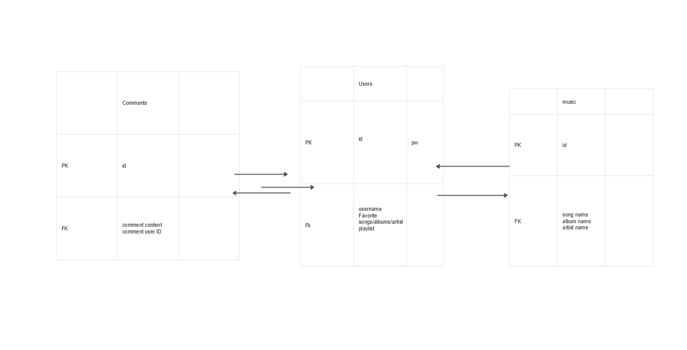
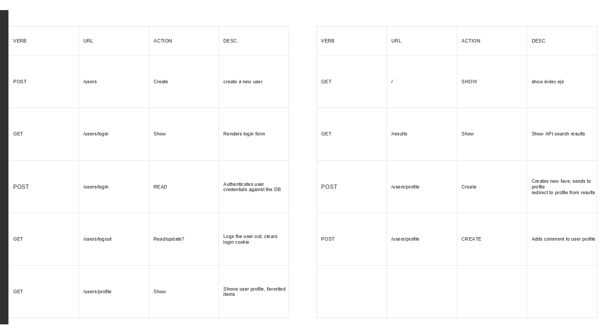
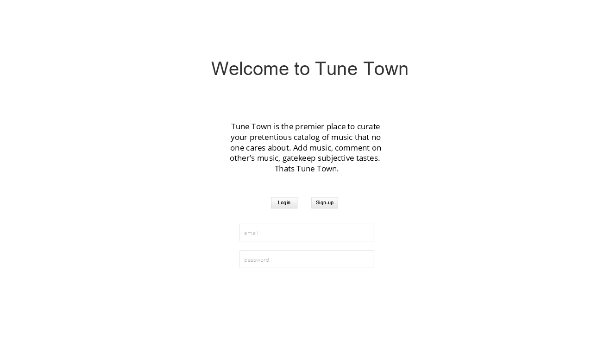
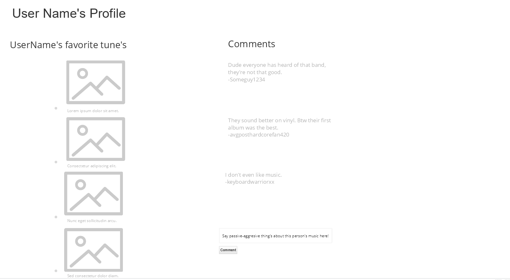
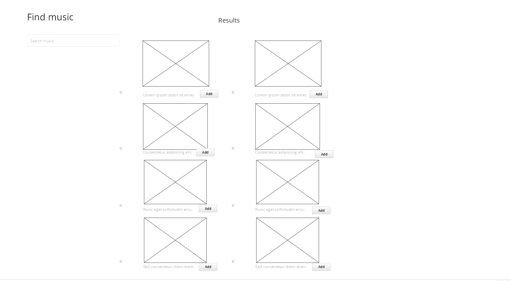

## Tune Town

Tune town is an app designed to catalog your favorite music. There's no worse feeling than forgetting the name of that band or song you recently heard. Now when you do find music you enjoy, you can add that band, album, or song to your personal catalog of music so you never forget again. Curate your list of favorite music, edit that list, and comment on other user's catalog, telling them how horrible their taste in music is!

This app will be using either Discogs' API (this API has more features but is more of a pain to connect tto) or the Audio DB API (easier connectivity, but less data to pull from).

Deployment Link: https://tunetown425.herokuapp.com/

### ERD

### RESTful Routes

### VIEWS

#### Home Page

#### Profile

#### Results

### User Stories

- As a user, i want to be able to: Curate a catalog of music I listen to.
- As a user, i want to be able to: Comment on other users profile to discuss music in their catalog.
- As a user, i want to be able to search for music in a database to find the music I'm familiar with.

### Installation Instructions

- Clone this repository
- Open the directory of this app in your command line program and run "npm i" to install all dependant packages
- Create a '.env' file and add an encryption key with a value of your choosing (preferably something random). For example: ENC_KEY="asdf1234qwerty"
- Use the 'nodemon' command to run the app locally (defaulted to port 3002)
- Navigate to http://localhost:3002/ in your browser to use the app.
- The API key is a public test key, there is no need to change this for testing/demo purposes.

### Goals

#### MVP

- Have users with unique profiles.
- Ability for users to add songs, albums, or artists to their catalog on their profile.
- Ability to add comments on user profiles.

#### Stretch

- Add Styling.
- Add playlist sub sections to user profiles.
- Utilize discog API to search by genre to find new music.
